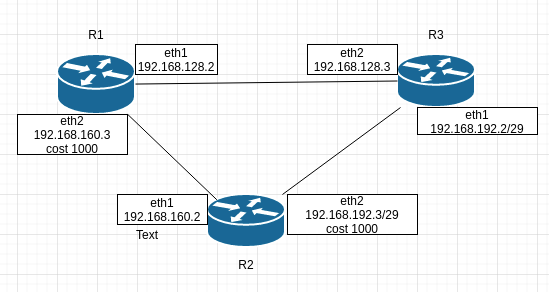
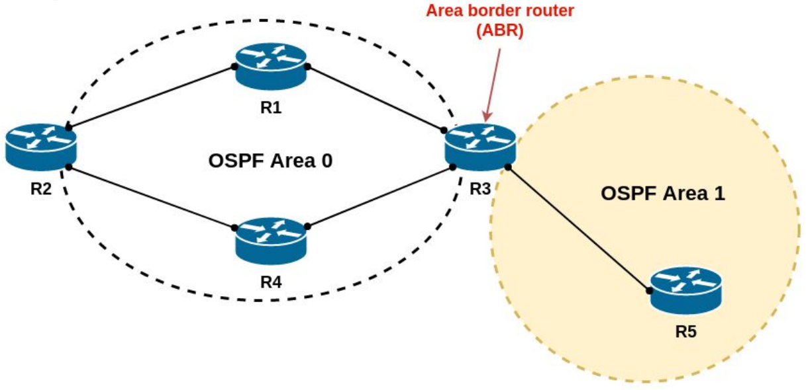
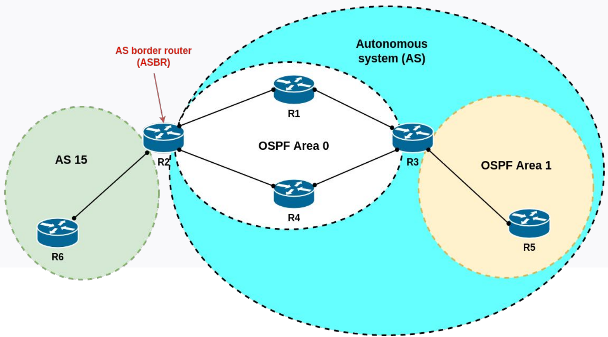
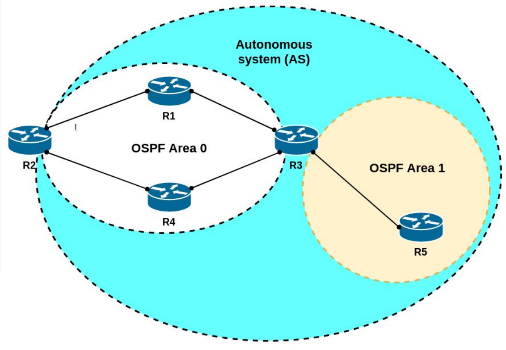
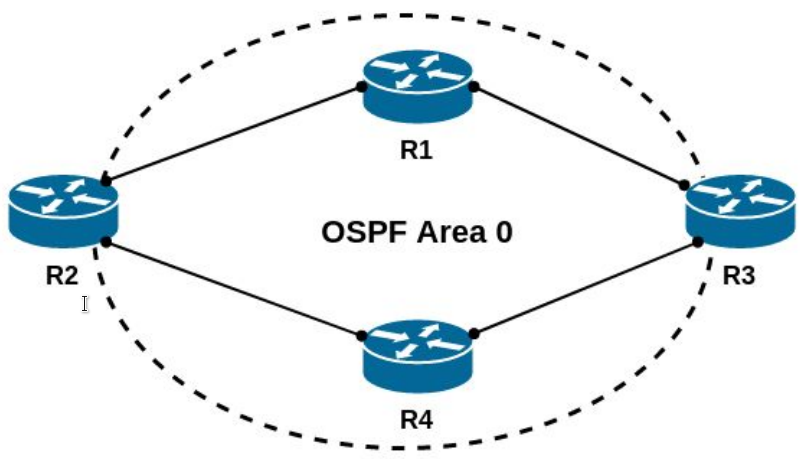

# Маршрутизация в сетях IPv4. OSPF
## Домашнее задание по теме

Задание:

Поднять три виртуалки
Объединить их разными vlan
Поднять OSPF между машинами на базе Quagga
Изобразить ассиметричный роутинг
Сделать один из линков "дорогим", но что бы при этом роутинг был симметричным

1. Развернуть рабочий стенд c помощью Vagrant

2. OSPF поднимается с помощью frr (fork Quagga)

3. Для создания ассимитричного роутинга меняем стоимость маршрута на интерфейсах.

Запуск отдельного playbook, для установки значений стоимости маршрута в ospf. Устанавливаем значение  "ip ospf cost 1000" в файле  ""/etc/frr/ospfd.conf" на роутерах R1 и R2 на интерфейсах eth2 (R1-eth2-192.168.160.3) (R2-eth2-192.168.192.3) .

      ansible-playbook ./ansible/playbooks/ospf_cost.yml  --limit R1_costs

Для возврата к исходному состоянию параметров стоимости маршрутов, выполнить playbook **"./ansible/playbooks/ospf_restore_cost.yml"**

      ansible-playbook ./ansible/playbooks/ospf_restore_cost.yml

4. Изменим стоимость маршрута на двух интерфейсах, сделаем их одинаково дорогими. на роутерах R1 и R2 увеличим стоимость на одинаковое значение (1000), на интерфейсах eth2 (R1-eth2-192.168.160.3) (R2-eth2-192.168.192.3) .

      ansible-playbook ./ansible/playbooks/ospf_cost.yml

Для возврата к исходному состоянию параметров стоимости маршрутов, выполнить playbook **"./ansible/playbooks/ospf_restore_cost.yml"**

      ansible-playbook ./ansible/playbooks/ospf_restore_cost.yml

SELinux:

ausearch -c 'watchfrr' --raw | audit2allow -M lwatchfrr
semodule -X 300 -i lwatchfrr.pp

#   Общая теория, примеры, полезности.

- **LSDB (Link state database)** — структура (база) данных для хранения данных топологии OSPF, база данных о состоянии линков.
- **SPF (Shortest Path First)** — название алгоритма OSPF для анализа LSDB и определения лучшего маршрута (с наименьшей стоимостью) для каждого префикса
- **LSU (Link State Update)** — пакет OSPF, в котором передается детальная информация о топологии, в частности LSA
- **LSA (Link State Advertisement)** — класс структуры данных OSPF, которых содержит информацию о топологии. LSA хранятся в LSDB и передаются по сети внутри LSU
- **Area** — группа маршрутизаторов и их интерфейсов
- **Backbone router** — маршрутизатор, у которого как минимум один интерфейс находится в Backbone Area (area 0).

    >Area 0 это не простая зона — это так называемая Backbone-area. Это означает, что она объединяет все остальные зоны, т.е. пакет, идущий от любой ненулевой зоны в любую ненулевую, обязан проходить через area 0

- **ABR (Area Border Router)** — маршрутизатор, у которого интерфейсы подключены как минимум к двум разным OSPF Area, включая Backbone Area (area 0)

- **Internal router** — маршрутизатор, интерфейсы которого находятся только в одной Area
- **DR (Designated Router)** — в multiaccess-сетях (в одной подсети может находиться более 2-х маршрутизаторов) маршрутизатор, который выбирается среди других маршрутизаторов для генерации LSA, обмена топологиями и т.д.
- **BDR (Backup Designated Router)** — маршрутизатор в multiaccess-сетях, который «наблюдает» за Designated Router‘ом (DR) и занимает его место в случае, если Designated Router (DR) становится недоступным
- **ASBR (Autonomous System Border Router)** — маршрутизатор, который соединяет 2 или более автономные системы и используется в основном для анонсирования маршрутов из одной автономной системы в другую(-ие)

- **AS (Автономная система)** — группа маршрутизаторов, обменивающаяся маршрутизирующей информацией с помощью одного протокола маршрутизации

- **Для того, чтобы маршрутизаторы договорились между собой (отношения смежности) должны выполниться следующие условия:**

1. в OSPF должны быть настроены одинаковые Hello Interval на тех маршрутизаторах, что подключены друг к другу. По умолчанию это 10 секунд в Broadcast сетях, типа Ethernet. Это своего рода KeepAlive сообщения. То есть каждые 10 секунд каждый маршрутизатор отправляет Hello пакет своему соседу, чтобы сказать: “Хей, я жив”.
2. Одинаковыми должны быть и Dead Interval на них. Обычно это 4 интервала Hello - 40 секунд. Если в течение этого времени от соседа не получено Hello, то он считается недоступным и начинается ПАНИКА процесс перестроения локальной базы данных и рассылка обновлений всем соседям.
3. Интерфейсы, подключенные друг к другу, должны быть в одной подсети.
4. OSPF позволяет снизить нагрузку на CPU маршрутизаторов, разделив Автономную Систему на зоны. Так вот номера зон тоже должны совпадать.
5. У каждого маршрутизатора, участвующего в процессе OSPF есть свой уникальный индентификатор - Router ID. Если вы о нём не позаботитесь, то маршрутизатор выберет его автоматически на основе информации о подключенных интерфейсах (выбирается высший адрес из интерфейсов, активных на момент запуска процесса OSPF). Но опять же у хорошего инженера всё под контролем, поэтому обычно создаётся Loopback интерфейс, которому присваивается адрес с маской /32 и именно он назначается Router ID. Это бывает удобно при обслуживании и траблшутинге.
6. Должен совпадать размер MTU.

- Процесс инициализации и постороения сети:

Дано:
  2 маршрутизатора R1 (RouterID: 1.1.1.1) и R2 (RouterID: 2.2.2.2)

   1. Состояние OSPF - **DOWN**
   2. Маршрутизатор рассылает Hello-пакеты на **мультикастный адрес 224.0.0.5 со всех интерфейсов, где запущен OSPF**. TTL таких сообщений равен одному, поэтому их получат только маршрутизаторы, находящиеся в том же сегменте сети. R1 переходит в состояние **INIT**.

          В пакеты вкладывается следующая информация:
          Router ID
          Hello Interval
          Dead Interval
          Neighbors
          Subnet mask
          Area ID
          Router Priority
          Адреса DR и BDR маршрутизаторов
          Пароль аутентификации

Сообщение Hello от маршрутизатора R1 несёт в себе его Router ID и не содержит Neighbors, потому что у него их пока нет.  

      Hello
      Router ID 1.1.1.1
      Hello interval 10
      Dead interval 40
      Neighbors Null
      Area ID 0

После получения этого мультикастного сообщения маршрутизатор R2 добавляет R1 в свою таблицу соседей (если совпали все необходимые параметры). И отправляет на R1 уже юникастом новое сообщение Hello, где содержится Router ID этого маршрутизатора, а в списке Neigbors перечислены все его соседи. В числе прочих соседей в этом списке есть Router ID R1, то есть R2 уже считает его соседом.  

      Hello
      Router ID 2.2.2.2
      Hello interval 10
      Dead interval 40
      Neighbors 1.1.1.1
      Area ID 0  

  3.  Когда R1 получает это сообщение Hello от R2, он пролистывает список соседей и находит в нём свой собственный Router ID, он добавляет R2 в свой список соседей. Это означает, что между ними установлены отношения смежности и маршрутизатор R1 переходит в состояние **2-WAY**.
  4. Далее все переходят в состояние **EXSTART**. Здесь все соседи решают между собой, кто главный. Им становится **маршрутизатор с наибольшим Router ID - R2**.
  5. Когда выбран главный, соседи переходят в состояние **Exchange** и обмениваются DBD-сообщениями (или DD) - Data Base Description, которые содержат описание LSDB (Link State Data Base), мол, я знаю про вот такие подсети.  
**LSDB - база данных о состоянии линков**. В изначальном состоянии маршрутизатор знает только о тех линках (интерфейсах), на которых запущен процесс OSPF. По ходу работы, каждый маршрутизатор собирает всю информацию о сети и составляет топологию. Именно она и будет являться LSDB, которая должна быть одинакова на всех членах зоны. Первым отсылает свою DBD маршрутизатор, выбранный главным на данном интерфейсе - 2.2.2.2. Следом за ним то же делает и 1.1.1.1.
  6. Получив сообщение, маршрутизаторы R1 и R2 отправляют подтверждение о приёме DBD (LSAck), а затем сравнивают новую информацию с той, что содержится у них в LSDB и, если есть отличия, посылают LSR (Link State Request) друг другу, тем самым переходя в новое состояние **LOADING**. В LSR они говорят - “Я про вот эту сеть ничего не знаю. Расскажи мне подробнее”.
  7. R2, получив LSR от R1, высылает LSU (Link State Update), которые содержат в себе LSA (Link State Advertisement) c детальной информацией о нужных подсетях. Как только R1 получит последнюю порцию данных о всех подсетях и сформирует свою LSDB, он переходит в своё конечное состояние FULL STATE. К тому моменту, как все маршрутизаторы зоны придут к состоянию Full State на всех на них должна быть полностью одинаковая LSDB,  это означает, что маршрутизатор знает всю вашу сеть, что, как и куда подключено.
  8.  Следующим шагом OSPF, используя алгоритм Дейкстры (или его ещё называют SPF - Shortest Path First), вычисляет кратчайший маршрут до каждого маршрутизатора в зоне - он ведь знает всю топологию. В этом ему помогают метрики. Чем она ниже, тем маршрут лучше. **Метрика - это стоимость движения по маршруту**.

>Например, из R1 добраться до R3, можно напрямую, Но это при условии, что у вас везде одинаковый тип интерфейсов. А если, например, между R1 и R3 модемное соединение в 56к или крайне нестабильный GPRS линк, тогда у них будет очень высокая стоимость и OSPF предпочтёт более длинный (R2->R4->R3), но быстрый путь. Найденный путь потом добавляется в таблицу маршрутизации.
Теперь каждые 10 секунд каждый маршрутизатор будет отправлять Hello-пакеты, а каждые 30 минут рассылаются LSA - это типа данные уже считаются устаревшими, надо бы обновить, даже если изменений не было.

Для контроля состояния каналов и связей между маршрутизаторами каждые 10 секунд каждый маршрутизатор будет отправлять Hello-пакеты, а каждые 30 минут рассылаются LSA - это типа данные уже считаются устаревшими, надо бы обновить, даже если изменений не было.   
Как только падает какой-либо из линков (или несколько), маршрутизатор изменяет свою LSDB и генерирурет LSU, присваивая ей номер больше, чем он был прежде (у каждой LSDB есть номер, который берётся из последнего полученного LSA).

Это LSU сообщение рассылается на мультикастовый адрес 224.0.0.5. Маршрутизаторы получившие его, проверяют номер LSA, содержащихся в LSU.
1) Если номер больше, чем номер текущей LSA маршрутизатора - LSDB меняется. (Версия LSDB старая, информация новая),
2) Если номер такой же, ничего не происходит. Этот маршрутизатор уже получил данный LSA по какому-то другому пути,
3) Если номер полученного LSA меньше локальной LSDB, это означает, что у маршрутизатора уже более актуальная информация, и он посылает новый LSA (на основе своей LSDB) отправителю прежнего.

После произведённых (или непроизведённых) действий соседу, от которого пришёл LSU пересылаются LSAck (мол, "посылку получили - всё в порядке"), а другим соседям отправляется изначальный LSU без изменений. На данном маршрутизаторе снова запускается алгоритм SPF и, при необходимости, обновляется таблица маршрутизации.

Вся настройка в данный момент, сводится к настройке сети между маршрутизаторами, для активации OSPF, установления соединений и создания таблиц маршрутизации. По мере наполнения роутеров клиентскими сетями, будут изменятся и таблицы маршрутизации и конфигурации роутеров. Пример добавления  рабочей сети:

#### Команды управления роутером
**vtysh**

- Подробная информация по соседу:

      sh ip ospf neighbor detail

- Просмотр таблицы маршрутизации:

      show ip route

- Просмотр конфигурции роутера:

      show running-config
